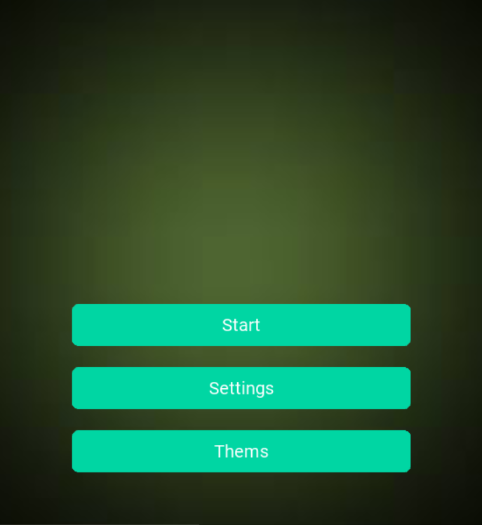
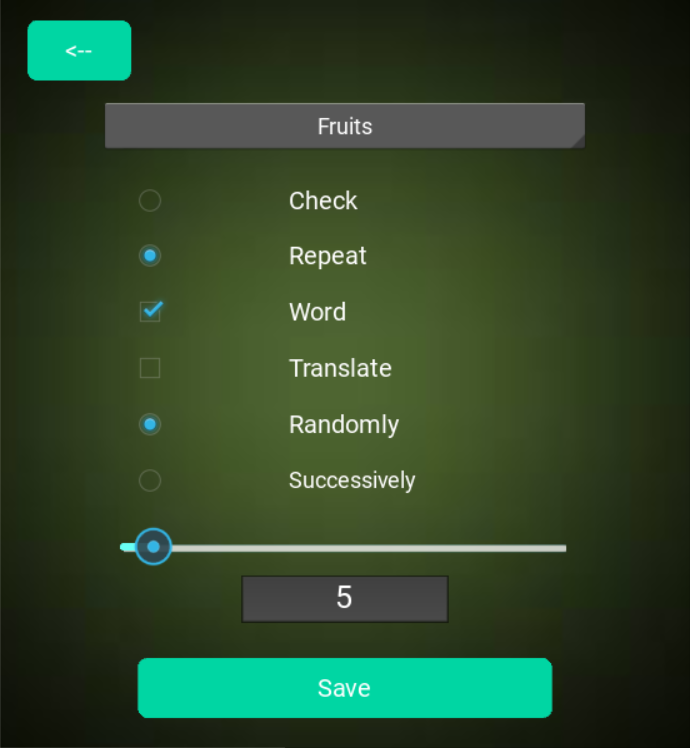
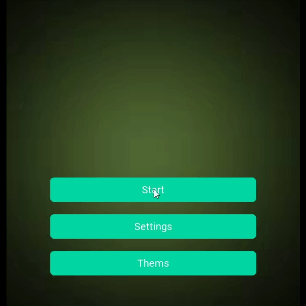

# Dictionary

## Project description

**Dictionary** is the perfect learning tool for anyone interested in learning a foreign language. Our program offers a simple and effective way of learning that will help you quickly expand your vocabulary and improve your language skills. Forget about outdated paper dictionaries - with Dictionary, language learning becomes an exciting journey!

### The main functions of the program:

+ **Convenient word addition**: Easily add new words to your vocabulary and group them by topic to better organize your learning.

+ **Knowledge testing**: Use built-in tests to check your knowledge and identify weaknesses for further improvement.

+ **Audio pronunciation of words**: The program allows you to listen to the pronunciation of words so that you can memorize them better and improve your pronunciation.

+ **Study anytime, anywhere**: Our program is available for use even without an Internet connection, allowing you to study at any location that suits you.

## Installation

Instal from Github:
```python
pip isntall https://github.com/OleksandrHrynchak/Dictionary.git
```
After downloading the repository to your computer, install all the dependencies specified in the file `requirements.txt`. 

```python
pip install -r requirements.txt
```
 Then run the main program file `main.py`.


## Examples of use

To start using the program, open the main `menu`. Here you will find access to all the main features that will help you learn a foreign language effectively.
<p align="center">
  
</p>

 Go to the `Theme` section to add new words to your vocabulary. In this section, you can choose different topics to study to organize your knowledge and make it easier to remember new words.
 <p align="center">
  
</p>

In the `Settings` section, you can customize your learning experience to suit your needs. Here you can choose the time you want to study a topic, the modes of word output, and other options to help you optimize your learning experience.
<p align="center">
  
</p>

 Once you've set up your settings, you can start learning by going to the Get `Start` section. Here you can test your knowledge and improve your language skills by completing various tasks and tests.
<p align="center">
  
</p>

If you have additional questions or need assistance, please contact our support team.
<p>
  
  <a align="" href="mailto:oleksandrhrynchak02@gmail.com" style="vertical-align: middle;">Email</a>
</p>